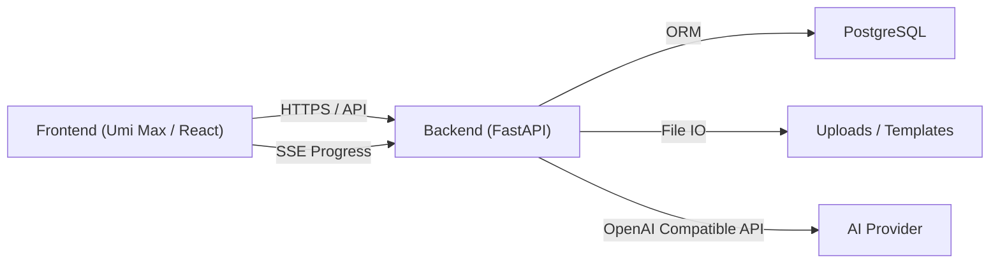
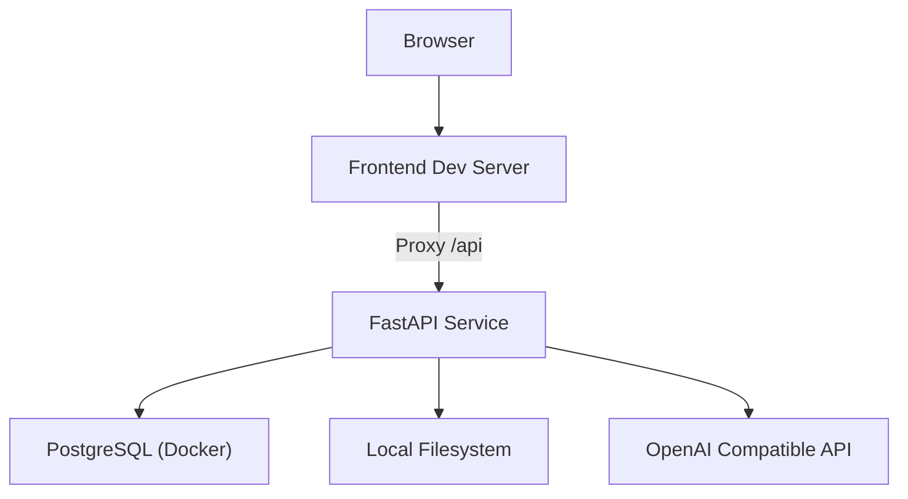

# 系统架构设计

## 架构概览
系统采用前后端分离架构，前端通过 HTTP 与 SSE 调用后端 API，后端处理业务逻辑、数据库读写、文件存储与 AI 调用，并通过 Word 模板渲染生成文档。

## 组件职责
前端职责：课程管理、文档管理、生成流程的交互界面与 SSE 进度展示。
后端职责：统一鉴权、业务逻辑处理、AI 调用、文档渲染与文件管理。
数据库职责：存储用户、课程、文档与聊天历史。
文件系统职责：保存上传文件与生成的 Word 文档。

## 部署拓扑

## 运行时交互
- 认证与鉴权由后端中间件统一处理，支持 Header 与 Query Token。
- 文档生成使用 SSE，前端以 EventSource 订阅进度事件。
- 生成文档存储于 `backend/uploads` 并通过静态路由访问。
